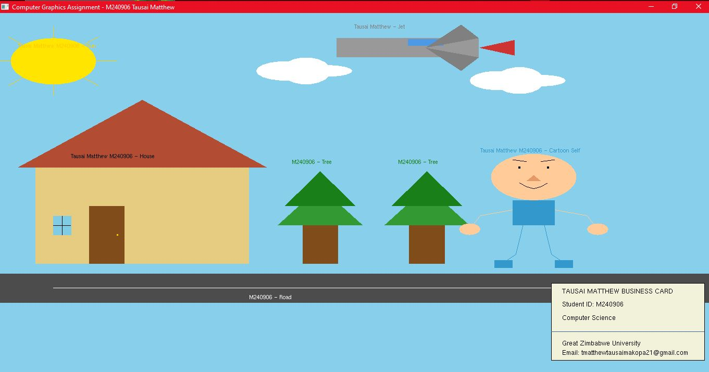
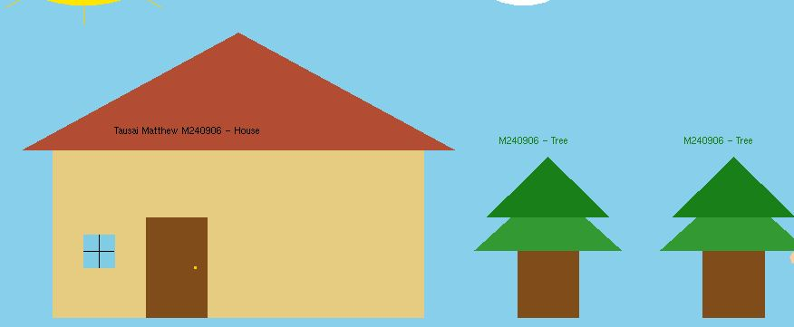
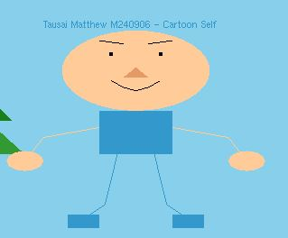
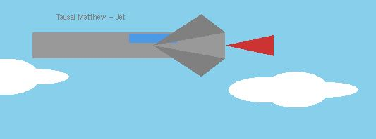

# Computer Graphics Assignment
## Great Zimbabwe University
### Module: ISH407/HCS411 – Computer Graphics

## Student Information

STUDENT NAME:  TAUSAI MATTHEW
REG NUMBER:    M240906 BLOCK RELEASE PART 3.1
MODULE COURSE: ISH407/HCS411
ASSIGNMENT:    INDIVIDUAL PRACTICAL EXERCISE

## Assignment Tasks Completed

### Task A – Geometric Primitives Scene
Created a scene using geometric primitives including:
- House (GL_QUADS, GL_TRIANGLES)
- Trees (GL_QUADS, GL_TRIANGLES)
- Road with center line (GL_QUADS, GL_LINE_STRIP)
- Sun with rays (GL_POLYGON, GL_LINES)
- Clouds (GL_POLYGON)

### Task B – Cartoon Character (Near/Far Plane)
Created a full cartoon character with:
- Head (near plane – larger)
- Body (near plane – larger)
- Arms and legs (far plane – thinner lines)
- Hands and feet (far plane – smaller)
- Uses points, lines, triangles, quads, and polygons

### Task D – Personal Business Card
Created a professional business card with:
- Name: Tausai Matthew
- Student ID: M240906
- Course: Computer Science
- University: Great Zimbabwe University
- Email: matthewtausaimakopa21@gmail.com

### Task F – Animated Jet
Created an animated jet that:
- Flies from left to right across the screen
- Resets and repeats continuously
- Uses geometric primitives (quads, triangles)

---

## How to Compile and Run

### Requirements
- Code::Blocks with MinGW compiler
- GLUT/FreeGLUT library installed

### Compilation Instructions
1. Open the project in Code::Blocks
2. Set linker options: `-lglut32 -lopengl32 -lglu32 -lgdi32 -lwinmm`
3. Press F9 to build and run

### Controls
- Press `Q` or `q` to exit the program

---

## Screenshots

### Full Assignment View

### Task A - Scene

### Task B - Cartoon Character

### Task D - Business Card

### Task F - Animated Jet

---

## GitHub Repository Structure
